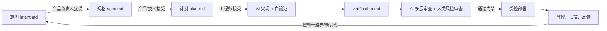

# AIN-Loop：通用 AI-Native 研发框架

AIN-Loop（AI-Native Engineering Loop）是一套厂商无关、可渐进落地的软件研发操作框架。它不把 AI 当作“更快的代码生成器”，而把研发改造成由**可执行工件**、**自动化控制**和**人类风险判断**驱动的闭环。

本框架吸收了 Anthropic 的 AI-Native SDLC 思路，但不依赖 Claude、GitHub、Jira 或某个云厂商；任意具备 Agent、Git、CI/CD、监控和工单能力的技术栈均可采用。

当前版本同时包含一个零第三方依赖的智能编排器 `ain`。它可以初始化业务仓库、创建变更、校验工件完整性、根据内容与代码路径推断风险下限、动态计算审批角色、执行阶段门禁、维护审计日志，并为下一阶段生成可直接交给 Agent 的提示。

## 五分钟开始

要求 Python 3.9+。在本框架目录运行：

```bash
./bin/ain --target /path/to/your-service init --with-github
```

进入业务仓库，创建第一个变更：

```bash
./.ain/ain new \
  --title "用户可以查询退款状态" \
  --owner "Lin" \
  --source customer_feedback
```

命令会输出类似 `CHG-20260828-001` 的编号。补全生成的 `intent.md` 后执行：

```bash
./.ain/ain validate CHG-20260828-001
./.ain/ain risk CHG-20260828-001 --paths services/payments/refund.py --write
./.ain/ain approve CHG-20260828-001 \
  --stage intent --role product_owner --by Lin
./.ain/ain next CHG-20260828-001 --prepare
```

最后一个命令会创建下一阶段工件，并输出一段带上下文、风险边界和完成条件的 Agent 提示。把它交给 Codex、Claude Code 或其他代码 Agent 即可。之后持续运行 `next --prepare`；当等待人类判断时，它会改为输出准确的审批角色和命令。

随时查看全局状态：

```bash
./.ain/ain status CHG-20260828-001
./.ain/ain gate CHG-20260828-001 --through plan
```

`gate --through plan` 会同时检查 intent、spec、plan 的内容、风险对应的全部批准和前置关系。未满足时返回非零状态，可直接放进 CI。

## 智能编排能力

| 能力 | 实现方式 | 结果 |
| --- | --- | --- |
| 内容感知风险 | 扫描工件关键词与拟修改路径，取“声明风险”和“推断风险”中的较高者 | Agent 或人不能静默降低风险 |
| 动态审批 | 风险级别与阶段共同计算所需角色 | 支付、隐私、迁移、生产变更自动增加技术/安全/发布批准 |
| 工件校验 | 检查元数据、必需章节、空内容、占位符和通过状态 | 空模板、伪完成、错 change ID 无法过门 |
| 状态机 | 从真实工件和批准记录推导下一动作 | 不依赖聊天上下文判断项目进度 |
| Agent 路由 | 为六阶段分别生成受边界约束的提示 | Agent 只处理当前阶段，不能自行越权审批 |
| 审计 | 每次创建、风险评估、工件准备和批准写入 JSONL | 可还原谁在何时基于什么角色作出决定 |
| CI 门禁 | `validate` 与 `gate --through <stage>` 返回确定性退出码 | 模型判断之外仍有可执行控制 |

风险词、保护路径、阶段、模板和审批矩阵均位于业务仓库的 `.ain/config.json`，可由平台及策略所有者通过 PR 管理。提示位于 `.ain/prompts/`；修改配置或提示时，应运行 Agent eval 回归集。

`approve --by` 是本地审计记录，不是身份认证系统。正式环境必须用代码托管平台的登录身份、CODEOWNERS、受保护分支、CI 服务身份和发布系统权限来证明“谁有权批准”；Agent 账号不得拥有修改审批记录后直接合并或发布的组合权限。

## 一句话定义

`意图 → 规格 → 计划 → 实现与验证 → 独立审查 → 受控发布 → 观测与学习 → 新意图`

每一步都提交一个可追溯工件；下一步只读取已接受的上一步工件。AI 可执行工作、提交建议和发起 PR，但不能绕过确定性控制或风险闸门。

## 为什么需要它

Agent 让“写代码”从数天缩短到数小时后，瓶颈会转移到需求澄清、测试、审查、发布和事故处理。若仍沿用人工逐行审查和周会审批：要么排队激增，要么质量与治理失效。AIN-Loop 的目标是让控制能力与 Agent 的产出速度同步，而非移除控制。

## 核心原则

1. **工件优先**：聊天、会议与票据不是唯一事实；每次决策须沉淀为版本化、机器可读的工件。
2. **策略即代码**：团队知识、合规规则和发布准则以受版本控制的策略、技能、规则或测试表达。
3. **建议与强制分层**：提示词/技能用于预防；Hook、分支保护、CI 和权限策略用于强制执行。
4. **证据先于结论**：Agent 声明“完成”前必须附构建、测试、扫描或验收证据。
5. **人审风险，不审机械劳动**：人负责目标、例外、伦理、业务影响和高风险变更；机器负责重复检查。
6. **最小权限与可撤销性**：按环境、仓库、工具、时效授权；生产操作必须可审计、可回滚。
7. **从生产学习**：故障、漏检和人工纠正必须回写为评测、策略或下一轮意图，形成闭环。

## 最小落地包

将下列内容复制到任一产品仓库（或把 `intent/` 放在独立产品工件仓库）：

```text
ai/
  intent/                 # 已接受/进行中的意图
  changes/<change-id>/    # spec.md、plan.md、verification.md
  policies/               # 组织策略的机器可读版本（技能/规则）
  evals/                  # Agent 配置的回归评测
  incidents/              # 事故、复盘和派生意图
  metrics/                # 指标定义与控制带
AGENTS.md                 # 仓库上下文、命令、边界和常见错误
REVIEW.md                 # AI + 人类审查合同
```

本目录提供可直接改名使用的模板：

- [intent.md](templates/intent.md)：业务/事故入口。
- [spec.md](templates/spec.md)：需求与技术/体验设计合并工件。
- [plan.md](templates/plan.md)：先计划、后修改的实施合同。
- [verification.md](templates/verification.md)：可审计的验证证据。
- [REVIEW.md](templates/REVIEW.md)：多层 Agent 审查与人审边界。
- [control-bands.yaml](config/control-bands.yaml)：生产闭环的确定性触发器。
- [rollout-checklist.md](checklists/rollout-checklist.md)：90 天落地路径。

## 框架主循环



初期应由人手动触发每一阶段；工件、策略、评测稳定后，再用 Git 事件、CI、工单或监控告警自动触发下一阶段。**自动触发不等于自动批准。**

## 六阶段运行模型

| 阶段 | AI 的职责 | 人的不可替代职责 | 强制控制 | 产出 / 触发 |
| --- | --- | --- | --- | --- |
| 1. Plan | 追问、归纳问题和约束 | 确认问题真实、范围正确 | 模板校验、产品负责人接受 | `intent.md` |
| 2. Design | 基于策略产出规格，标记冲突 | 选择取舍、处理例外 | 策略版本记录、风险分级 | `spec.md` |
| 3. Build | 先生成计划，再实现和自检 | 接受计划、处理高风险方案 | 受限工具、保护路径、密钥扫描 | `plan.md`、代码与测试 |
| 4. Test | 循环运行验证并修复；维护评测 | 判断验收是否充分 | CI、质量阈值、独立验证者 | `verification.md`、eval 结果 |
| 5. Deploy | 审查 PR、分诊失败、准备发布/回滚 | 审查意图与风险；生产授权 | 分支保护、环境权限、发布 Hook | PR、发布记录 |
| 6. Maintain | 定时扫描、诊断、提案、受控自愈 | 事故分级和关键决策 | 控制带、变更门禁、回滚演练 | 事故记录、新 `intent.md` |

## 工件契约

所有工件必须具有：`change_id`、状态、作者/Agent 身份、关联工件、策略版本、风险级别、决策者和时间戳。一个变更只指定一个事实来源：仓库、Jira/ServiceNow 或其他系统三选一；其余系统只保留链接与不可变的提交 SHA。

建议状态机：

```text
draft → proposed → accepted → in_progress → verified → reviewed → released → observed
                       ↘ rejected / superseded / rolled_back
```

## 自主性与风险矩阵

自主性必须随风险提升而收缩，而不是按“模型能力”一刀切。

| 风险级别 | 示例 | Agent 权限 | 必需人类闸门 |
| --- | --- | --- | --- |
| R0 低 | 文档、格式、已有测试覆盖的小修复 | 可自动创建 PR、开发环境部署 | PR 规则自动合并可选 |
| R1 一般 | 普通业务逻辑、非生产配置 | 可改代码、跑 CI、提审 | 代码所有者 |
| R2 高 | 鉴权、支付、隐私、数据库迁移 | 仅提案/PR，不直接执行 | 技术负责人 + 策略所有者 |
| R3 关键 | 生产基础设施、不可逆数据、监管范围 | 只读诊断和生成变更包 | 指定授权人；双人复核或 CAB |

采用五级成熟度推进：L0 辅助问答；L1 人在回路的 Agent；L2 由工件和 CI 驱动的受控 Agent；L3 非生产事件驱动；L4 生产闭环（仅预批准、可回滚操作）。不要从 L0 直接跳到 L4。

## 控制平面：三道防线

| 防线 | 机制 | 解决的问题 |
| --- | --- | --- |
| 预防 | `AGENTS.md`、技能/策略、计划模式、最小权限 | 让 Agent 一开始就按正确上下文工作 |
| 阻断 | Hook、受保护路径、密钥/依赖策略、CI 阈值、分支保护 | 让不可违反的规则不能被绕过 |
| 侦测与学习 | 独立 Agent 审查、SAST/DAST、评测、控制带、审计日志 | 发现遗漏并把经验沉淀为新控制 |

提示词不能充当安全边界；任何“绝不能发生”的规则，都必须有确定性的阻断或检测措施。

## 角色与责任

- **产品负责人**：接受意图与规格，拥有价值与范围决策。
- **工程师/技术负责人**：接受实施计划，拥有架构与变更风险决策。
- **策略所有者**（安全、法务、合规、品牌等）：维护对应策略和例外规则。
- **平台团队**：维护 Agent 运行时、权限、Hook、CI、遥测和评测基线。
- **代码所有者/发布经理**：执行 PR 或生产环境闸门。
- **服务所有者**：拥有控制带、回滚 Runbook 与事故闭环。

AI 永不成为责任主体：每个 Agent 运行均应能归属到触发人、服务账号与授权策略版本。

## 核心指标

同时观察速度、质量、安全、治理和学习，不能只看“AI 生成了多少行代码”。

| 维度 | 领先指标 | 滞后指标 |
| --- | --- | --- |
| 流动效率 | 意图→规格、规格→计划、计划→首个 PR 的耗时 | Lead time、部署频率 |
| 工程质量 | Agent 变更首次 CI 通过率、评测通过率 | 返工轮次、变更失败率、逃逸缺陷率 |
| 审查能力 | 首次审查时间、AI 评论自动解决率 | 人工审查时长、严重问题的预发布捕获率 |
| 治理安全 | 拒绝/拦截次数、策略更新时延、权限覆盖率 | 生产违规、密钥泄露、审计缺口 |
| 学习闭环 | 事故→eval/策略/意图的沉淀时长 | 同类事故复发率 |

## 先做什么

不要一开始就建设“全自动研发工厂”。选择一个低风险、重复度高、有可靠测试和明确负责人服务，依次完成：

1. 建立 `AGENTS.md`、四种基础工件和 `REVIEW.md`。
2. 强制“先计划、后实现；先验证、后提审”。
3. 用 CI 执行测试、扫描与分支保护；把一条关键策略做成可执行控制。
4. 为 20–50 个真实任务建立 Agent eval 基线。
5. 让 AI 先只读分诊和 PR 审查，随后才允许非生产写操作。
6. 将一个监控告警接入“诊断→提案→PR/回滚”的闭环，并演练回滚。

详细验收标准与阶段任务见 [rollout-checklist.md](checklists/rollout-checklist.md)。

## 采用边界

本框架不是把所有决策交给模型。涉及法律解释、用户伤害、资金、生产不可逆操作、数据删除、对外承诺或策略例外时，应明确停止在闸门前，升级到具有授权的人类负责人。

## 来源

框架的核心依据是 Anthropic 的《[The AI-Native SDLC playbook](https://claude.com/blog/the-ai-native-sdlc-playbook)》：以版本化工件承接六阶段、用技能与 Hook 分离建议和强制控制、用持续评测保持 Agent 配置质量，并以监控触发重新进入意图阶段。本文将这些产品特定实践抽象为可替换工具链的通用操作模型。
